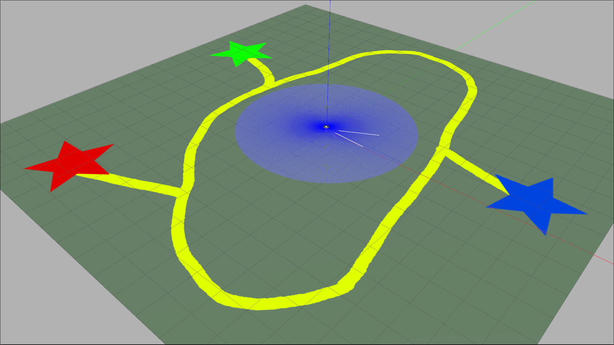

# Assignment 3-B: TurtleBot3 Vision Processing, Tracking and Following
**Authors:** Chinmay Samak and Tanmay Samak

## Disclaimer:
I certify that all the work and writing that I contributed to here is my own and not acquired from external sources. I have cited sources appropriately and paraphrased correctly. I have not shared my writing with other students (for individual assignments) and other students outside my group (for group assignments), nor have I acquired any written portion of this document from past or present students.

## Robot Setup:


- [`turtlebot3_burger.urdf`](https://github.com/Tinker-Twins/Autonomy-Science-And-Systems/blob/main/Assignment%203-B/assignment_3b/turtlebot3/turtlebot3/turtlebot3_description/urdf/turtlebot3_burger.urdf) from [`turtlebot3_description`](https://github.com/Tinker-Twins/Autonomy-Science-And-Systems/tree/main/Assignment%203-B/assignment_3b/turtlebot3/turtlebot3/turtlebot3_description) package was modified [to define the fixed links and joints](https://github.com/Tinker-Twins/Autonomy-Science-And-Systems/blob/47ece12be831e78be49e4889f11b2391f7642dcc/Assignment%203-B/assignment_3b/turtlebot3/turtlebot3/turtlebot3_description/urdf/turtlebot3_burger.urdf#L196-L223) (static transforms) for the camera module for simulating TurtleBot3 Burger with a camera in Gazebo simulator.
- [`model.sdf`](https://github.com/Tinker-Twins/Autonomy-Science-And-Systems/blob/main/Assignment%203-B/assignment_3b/turtlebot3/turtlebot3_simulations/turtlebot3_gazebo/models/turtlebot3_burger/model.sdf) from [`turtlebot3_gazebo`](https://github.com/Tinker-Twins/Autonomy-Science-And-Systems/tree/main/Assignment%203-B/assignment_3b/turtlebot3/turtlebot3_simulations/turtlebot3_gazebo) package was modified [to define links, physical properties](https://github.com/Tinker-Twins/Autonomy-Science-And-Systems/blob/47ece12be831e78be49e4889f11b2391f7642dcc/Assignment%203-B/assignment_3b/turtlebot3/turtlebot3_simulations/turtlebot3_gazebo/models/turtlebot3_burger/model.sdf#L318-L370) as well as the [fixed joints](https://github.com/Tinker-Twins/Autonomy-Science-And-Systems/blob/47ece12be831e78be49e4889f11b2391f7642dcc/Assignment%203-B/assignment_3b/turtlebot3/turtlebot3_simulations/turtlebot3_gazebo/models/turtlebot3_burger/model.sdf#L419-L435) (static transforms) for the camera module for simulating TurtleBot3 Burger with a camera in Gazebo simulator.

## Environment Setup:



- [`lane_keeping.world`](https://github.com/Tinker-Twins/Autonomy-Science-And-Systems/blob/main/Assignment%203-B/assignment_3b/assignment_3b/worlds/lane_keeping.world) file was defined to setup the base environment with lane lines on a plane.
- [`lane_keeping.sdf`](https://github.com/Tinker-Twins/Autonomy-Science-And-Systems/blob/main/Assignment%203-B/assignment_3b/assignment_3b/worlds/lane_keeping.sdf) was defined to spawn the [modified TurtleBot3 Burger with a camera](https://github.com/Tinker-Twins/Autonomy-Science-And-Systems/blob/main/Assignment%203-B/README.md#robot-setup) in the [`lane_keeping.world`](https://github.com/Tinker-Twins/Autonomy-Science-And-Systems/blob/main/Assignment%203-B/assignment_3b/assignment_3b/worlds/lane_keeping.world) environment.

\## Description:
The workspace for [`assignment_3b`](https://github.com/Tinker-Twins/Autonomy-Science-And-Systems/tree/main/Assignment%203-B/assignment_3b) includes multiple ROS2 packages for accessing camera frames, vision processing, AprilTag detection, etc. that act as "helper packages" to the main [`assignment_3b`](https://github.com/Tinker-Twins/Autonomy-Science-And-Systems/tree/main/Assignment%203-B/assignment_3b/assignment_3b) package.

The ROS2 package [`assignment_3b`](https://github.com/Tinker-Twins/Autonomy-Science-And-Systems/tree/main/Assignment%203-B/assignment_3b/assignment_3b) for this assignment hosts the following [Python scripts](https://github.com/Tinker-Twins/Autonomy-Science-And-Systems/tree/main/Assignment%203-B/assignment_3b/assignment_3b/assignment_3b):
- [`lane_keeping.py`](https://github.com/Tinker-Twins/Autonomy-Science-And-Systems/blob/main/Assignment%203-B/assignment_3b/assignment_3b/assignment_3b/lane_keeping.py) makes the robot perform lane keeping operation. The robot is commanded to move with 0.22 m/s linear velocity. The incomming RGB camera frame (320x240 px) is cropped according to the region of interest (ROI) of 10 px height and entire width, converted to [HSV](https://en.wikipedia.org/wiki/HSL_and_HSV) color space, and masked into a binary image using upper and lower HSV thresholds for `yellow color`. The binary image is then used to calculate moments (weighted average of image pixel intensities) to detect cluster of pixels (i.e. blob), compute the centroid of this blob, and then this centroid is used to calculate error (deviation) of robot from lane center. A PID controller (with FIFO integral anti-windup mechanism) operates on this error to accordingly command the robot's angular velocity (rad/s) to perform lane keeping operation. The script is setup to wait 4 seconds for everything to initialize properly and then run for eternity to demonstrate dynamically variable lane keeping application.
- [`lane_following.py`](https://github.com/Tinker-Twins/Autonomy-Science-And-Systems/blob/main/Assignment%203-B/assignment_3b/assignment_3b/assignment_3b/lane_following.py) makes the robot perform lane following operation. The robot is commanded to move with 0.06 m/s linear velocity. The incomming RGB camera frame (320x240 px) is cropped according to the region of interest (ROI) of 10 px height and entire width, converted to [HSV](https://en.wikipedia.org/wiki/HSL_and_HSV) color space, and masked into a binary image using upper and lower HSV thresholds for `white color`. The binary image is then used to calculate moments (weighted average of image pixel intensities) to detect cluster of pixels (i.e. blob), compute the centroid of this blob, and then this centroid is used to calculate error (deviation) of robot from lane center. A PID controller (with FIFO integral anti-windup mechanism) operates on this error to accordingly command the robot's angular velocity (rad/s) to perform lane following operation. The script is setup to wait 4 seconds for everything to initialize properly and then run for eternity to demonstrate dynamically variable lane following application.
- [`apriltag_tracking.py`](https://github.com/Tinker-Twins/Autonomy-Science-And-Systems/blob/main/Assignment%203-B/assignment_3b/assignment_3b/assignment_3b/apriltag_tracking.py) makes the robot detect and track AprilTag markers. The incomming compressed camera feed from the robot is uncompressed and fed to the AprilTag detection pipeline from which the relative 6D pose of the AprilTag marker with respect to the robot camera is extracted. The robot makes use of de-coupled longitudinal and lateral PID controllers (with FIFO integral anti-windup mechanism) acting on the `translational z` and `- translational x` components of robot relative marker pose respectively for motion control. The script is setup to wait 4 seconds for everything to initialize properly and then run for eternity to demonstrate dynamically variable AprilTag tracking application.

The ROS2 package [`assignment_3b`](https://github.com/Tinker-Twins/Autonomy-Science-And-Systems/tree/main/Assignment%203-B/assignment_3b/assignment_3b) for this assignment hosts the following [launch files](https://github.com/Tinker-Twins/Autonomy-Science-And-Systems/tree/main/Assignment%203-B/assignment_3b/assignment_3b/launch):
- [`lane_keeping.launch.py`](https://github.com/Tinker-Twins/Autonomy-Science-And-Systems/blob/main/Assignment%203-B/assignment_3b/assignment_3b/launch/lane_keeping.launch.py) launches [Gazebo simulator](https://gazebosim.org/home) with [`lane_keeping.sdf`](https://github.com/Tinker-Twins/Autonomy-Science-And-Systems/blob/main/Assignment%203-B/assignment_3b/assignment_3b/worlds/lane_keeping.sdf), the [`lane_keeping.py`](https://github.com/Tinker-Twins/Autonomy-Science-And-Systems/blob/main/Assignment%203-B/assignment_3b/assignment_3b/assignment_3b/lane_keeping.py) node as well as an [RViz](https://github.com/ros2/rviz) window to visualize the camera feed, laserscan and odometry estimates of the robot.
- [`lane_following.launch.py`](https://github.com/Tinker-Twins/Autonomy-Science-And-Systems/blob/main/Assignment%203-B/assignment_3b/assignment_3b/launch/lane_following.launch.py) republishes incomming [compressed images](http://docs.ros.org/en/melodic/api/sensor_msgs/html/msg/CompressedImage.html) (used for reducing on-board computational burden significantly) on `image/compressed` topic to `image/uncompressed` topic as [uncompressed images](http://docs.ros.org/en/noetic/api/sensor_msgs/html/msg/Image.html), launches the [`lane_following.py`](https://github.com/Tinker-Twins/Autonomy-Science-And-Systems/blob/main/Assignment%203-B/assignment_3b/assignment_3b/assignment_3b/lane_following.py) node as well as an [RViz](https://github.com/ros2/rviz) window to visualize the camera feed, laserscan and odometry estimates of the robot.
- [`apriltag_tracking.launch.py`](https://github.com/Tinker-Twins/Autonomy-Science-And-Systems/blob/main/Assignment%203-B/assignment_3b/assignment_3b/launch/apriltag_tracking.launch.py) republishes incomming [compressed images](http://docs.ros.org/en/melodic/api/sensor_msgs/html/msg/CompressedImage.html) (used for reducing on-board computational burden significantly) on `image/compressed` topic to `image/uncompressed` topic as [uncompressed images](http://docs.ros.org/en/noetic/api/sensor_msgs/html/msg/Image.html), launches the [`apriltag_node`](https://github.com/Tinker-Twins/Autonomy-Science-And-Systems/blob/main/Assignment%203-B/assignment_3b/apriltag_ros/src/AprilTagNode.cpp) with [tags_36h11.yaml](https://github.com/Tinker-Twins/Autonomy-Science-And-Systems/blob/main/Assignment%203-B/assignment_3b/apriltag_ros/cfg/tags_36h11.yaml) configuration, the [`apriltag_tracking.py`](https://github.com/Tinker-Twins/Autonomy-Science-And-Systems/blob/main/Assignment%203-B/assignment_3b/assignment_3b/assignment_3b/apriltag_tracking.py) node as well as an [RViz](https://github.com/ros2/rviz) window to visualize the camera feed and relative transformation between robot camera and AprilTag marker(s).

## Dependencies:
- [TurtleBot3 Burger Robot Hardware](https://www.robotis.us/turtlebot-3-burger-us/) with [TurtleBot3 SBC Image](https://emanual.robotis.com/docs/en/platform/turtlebot3/sbc_setup/)
- [ROS2 Foxy Fitzroy](https://docs.ros.org/en/foxy/Installation/Alternatives/Ubuntu-Development-Setup.html) on [Ubuntu 20.04 Focal Fossa](https://releases.ubuntu.com/focal/)
- [TurtleBot3 Packages](https://github.com/ROBOTIS-GIT/turtlebot3/tree/foxy-devel) - Included with this repository
- [TurtleBot3 Simulations Packages](https://github.com/ROBOTIS-GIT/turtlebot3_simulations/tree/foxy-devel) - Included with this repository
- [TurtleBot3 Messages Package](https://github.com/ROBOTIS-GIT/turtlebot3_msgs/tree/foxy-devel) - Included with this repository
- [TurtleBot3 Dynamixel SDK Packages](https://github.com/ROBOTIS-GIT/DynamixelSDK/tree/foxy-devel) - Included with this repository

## Build:

1. Make a directory `ROS2_WS` to act as your ROS2 workspace.
    ```bash
    $ mkdir -p ~/ROS2_WS/src/
    ```
2. Clone this repository:
    ```bash
    $ git clone https://github.com/Tinker-Twins/Autonomy-Science-And-Systems.git
    ```
3. Move `assignment_3b` directory with required ROS2 packages to the source space (`src`) of your `ROS2_WS`.
    ```bash
    $ mv ~/Autonomy-Science-And-Systems/Assignment\ 3-B/assignment_3b/ ~/ROS2_WS/src/
    ```
4. [Optional] Remove the unnecessary files.
    ```bash
    $ sudo rm -r Autonomy-Science-And-Systems
    ```
5. Build the packages.
    ```bash
    $ cd ~/ROS2_WS
    $ colcon build
    ```
6. Source the `setup.bash` file of your `ROS2_WS`.
    ```bash
    $ echo "source ~/ROS2_WS/install/setup.bash" >> ~/.bashrc
    $ source ~/.bashrc
    ```

## Execute:
### Simulation:
```bash
$ ros2 launch assignment_3b lane_keeping.launch.py
```

### Real World:
1. Connect to the TurtleBot3 SBC via Secure Shell Protocol (SSH):
    ```bash
    user@computer:~$ sudo ssh <username>@<ip.address.of.turtlebot3>
    user@computer:~$ sudo ssh ubuntu@192.168.43.48
    ```
2. Bringup TurtleBot3:
    ```bash
    ubuntu@ubuntu:~$ ros2 launch turtlebot3_bringup robot.launch.py
    ubuntu@ubuntu:~$ ros2 launch v4l2_camera camera.launch.py
    ```
3. Lane Following:
    ```bash
    user@computer:~$ ros2 launch assignment_3b lane_following.launch.py
    ```
4. AprilTag Tracking:
    ```bash
    user@computer:~$ ros2 launch assignment_3b apriltag_tracking.launch.py
    ```

## Results:
The [`media`](https://github.com/Tinker-Twins/Autonomy-Science-And-Systems/tree/main/Assignment%203-B/media) directory hosts pictures and videos of the implementations.

1. Simulation:


2. Real World:

|  |  |
|:-------------------------------------:|:-----------------------------------------:|
| Lane Following - TurtleBot3 | Lane Following - Remote PC |
|  |  |
| AprilTag Tracking - TurtleBot3 | AprilTag Tracking - Remote PC |
