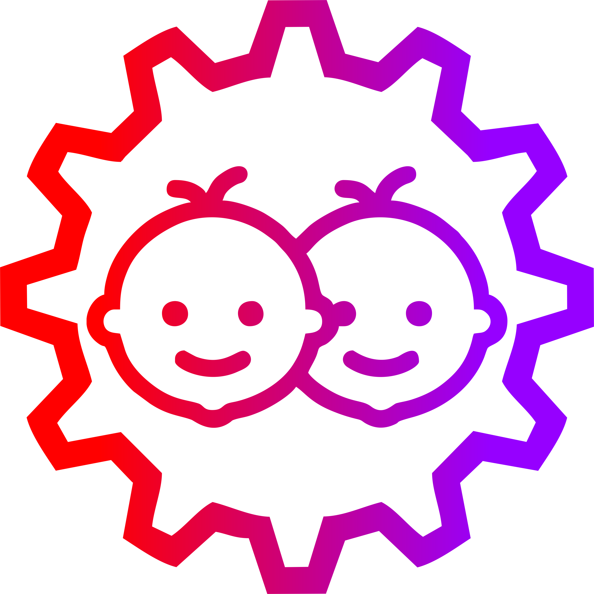

# Autonomy: Science and Systems @ CU-ICAR

This repository is a part of course AuE-8230 "Autonomy: Science and Systems" at CU-ICAR (Spring 2023).

## Course Description:

**AuE-8230:** Autonomy: Science and Systems, as the name suggests, introduces students to scientific (formulations) as well as technological (ROS-based implementation) advances in the field of autonomous systems. This course is handled by [Dr. Venkat Krovi](https://www.linkedin.com/in/venkatnkrovi), Michelin SmartState Chair Professor of Vehicle Automation at [Clemson University International Center for Automotive Research (CU-ICAR)](https://cuicar.com/) and director of [Automation, Robotics and Mechatronics Laboratory (ARMLab)](http://cecas.clemson.edu/armlab-cuicar).

## Group Name:

**Tinker Twins:** [Chinmay Samak](https://www.linkedin.com/in/samakchinmay) and [Tanmay Samak](https://in.linkedin.com/in/samaktanmay) are twin brothers, who use "Tinker Twins" as a personal brand (the team's name was therefore decided to reflect the same brand). The twins have come a long way tinkering with various tools and technologies, which has strengthened their scientific knowledge and skills. The duo has worked on various projects ranging from microelectromechanical systems (MEMS) to in-orbit space settlements, and almost everything in between. They have a particularly keen interest in the field of robotics and autonomous systems, and are specializing in the field of autonomous vehicles.

## Group Members:

**Chinmay Samak:** I received the [B.Tech. degree in Mechatronics Engineering](https://www.srmist.edu.in/program/b-tech-mechatronics-engineering/) with a gold medal from [SRM Institute of Science and Technology](https://www.srmist.edu.in/) in 2021. Having worked on several research projects in the field of autonomous vehicles, complemented with a solid background in mechatronics engineering, I have joined [ARMLab at CU-ICAR](http://cecas.clemson.edu/armlab-cuicar) as a direct Ph.D. candidate under the supervision of [Dr. Venkat Krovi](https://www.linkedin.com/in/venkatnkrovi) to pursue focused research in the field of vehicle automation. My research interests lie at the intersection of real and virtual worlds to create physically and graphically accurate digital twins. I am currently contributing towards projects such as [VIPR-GS](https://cecas.clemson.edu/VIPR-GS/), [OpenCAV](https://sites.google.com/view/opencav/), [AutoDRIVE](https://autodrive-ecosystem.github.io/) and [F1Tenth](https://f1tenth.org/).

**Tanmay Samak:** I received the [B.Tech. degree in Mechatronics Engineering](https://www.srmist.edu.in/program/b-tech-mechatronics-engineering/) with a silver medal from [SRM Institute of Science and Technology](https://www.srmist.edu.in/) in 2021. Having worked on several research projects in the field of autonomous vehicles, complemented with a solid background in mechatronics engineering, I have joined [ARMLab at CU-ICAR](http://cecas.clemson.edu/armlab-cuicar) as a direct Ph.D. candidate under the supervision of [Dr. Venkat Krovi](https://www.linkedin.com/in/venkatnkrovi) to pursue focused research in the field of vehicle automation. My research interests lie in formulation and development of socially and situationally aware autonomous systems. I am currently contributing towards projects such as [VIPR-GS](https://cecas.clemson.edu/VIPR-GS/), [OpenCAV](https://sites.google.com/view/opencav/), [AutoDRIVE](https://autodrive-ecosystem.github.io/) and [F1Tenth](https://f1tenth.org/).

## Repository Structure

Each of the following directories has a detailed `README.md` of their own.

 <a href="https://github.com/Tinker-Twins/Autonomy-Science-And-Systems/tree/main/Assignment%201-A"><b>Assignment 1-A</a>:</b> Comparative study of <a href="https://wiki.ros.org/noetic">ROS-1</a>, <a href="https://docs.ros.org/en/foxy/"> ROS-2</a> and <a href="https://rosindustrial.org/"> ROS-I</a>

  

  

  

 <a href="https://github.com/Tinker-Twins/Autonomy-Science-And-Systems/tree/main/Mini%20Assignment%201"><b>Mini Assignment 1</a>:</b> Picture-proofs of <a href="http://wiki.ros.org/noetic/Installation/Ubuntu">ROS-1 Noetic</a>, <a href="https://docs.ros.org/en/foxy/Installation/Alternatives/Ubuntu-Development-Setup.html"> ROS-2 Foxy</a> installations

|  |  |
|:-------------------------------------:|:-----------------------------------------:|
| ROS-1 Noetic Installation | ROS-2 Foxy Installation |
  

 <a href="https://github.com/Tinker-Twins/Autonomy-Science-And-Systems/tree/main/Mini%20Assignment%202"><b>Mini Assignment 2</a>:</b> Video-proofs of <a href="http://wiki.ros.org/noetic/Installation/Ubuntu">ROS-1 Noetic</a>, <a href="https://docs.ros.org/en/foxy/Installation/Alternatives/Ubuntu-Development-Setup.html"> ROS-2 Foxy</a> installations

|  |  |
|:-------------------------------------:|:-----------------------------------------:|
| ROS-1 Noetic Installation | ROS-2 Foxy Installation |
  

 <a href="https://github.com/Tinker-Twins/Autonomy-Science-And-Systems/tree/main/Assignment%201-B"><b>Assignment 1-B</a>:</b> Robot open and closed-loop control in <a href="https://docs.ros.org/en/foxy/Tutorials/Beginner-CLI-Tools/Introducing-Turtlesim/Introducing-Turtlesim.html"> TurtleSim</a>

|  |  |
|:------------------:|:-------------------:|
| Go in Circle | Go to Goal |
|  |  |
| Open Loop Square | Closed Loop Square |
  

 <a href="https://github.com/Tinker-Twins/Autonomy-Science-And-Systems/tree/main/Group"><b>Group</a>:</b> Group details for the course during Spring 2023

**Chinmay Samak:** I received the [B.Tech. degree in Mechatronics Engineering](https://www.srmist.edu.in/program/b-tech-mechatronics-engineering/) with a gold medal from [SRM Institute of Science and Technology](https://www.srmist.edu.in/) in 2021. Having worked on several research projects in the field of autonomous vehicles, complemented with a solid background in mechatronics engineering, I have joined [ARMLab at CU-ICAR](http://cecas.clemson.edu/armlab-cuicar) as a direct Ph.D. candidate under the supervision of [Dr. Venkat Krovi](https://www.linkedin.com/in/venkatnkrovi) to pursue focused research in the field of vehicle automation. My research interests lie at the intersection of real and virtual worlds to create physically and graphically accurate digital twins. I am currently contributing towards projects such as [VIPR-GS](https://cecas.clemson.edu/VIPR-GS/), [OpenCAV](https://sites.google.com/view/opencav/), [AutoDRIVE](https://autodrive-ecosystem.github.io/) and [F1Tenth](https://f1tenth.org/).

**Tanmay Samak:** I received the [B.Tech. degree in Mechatronics Engineering](https://www.srmist.edu.in/program/b-tech-mechatronics-engineering/) with a silver medal from [SRM Institute of Science and Technology](https://www.srmist.edu.in/) in 2021. Having worked on several research projects in the field of autonomous vehicles, complemented with a solid background in mechatronics engineering, I have joined [ARMLab at CU-ICAR](http://cecas.clemson.edu/armlab-cuicar) as a direct Ph.D. candidate under the supervision of [Dr. Venkat Krovi](https://www.linkedin.com/in/venkatnkrovi) to pursue focused research in the field of vehicle automation. My research interests lie in formulation and development of socially and situationally aware autonomous systems. I am currently contributing towards projects such as [VIPR-GS](https://cecas.clemson.edu/VIPR-GS/), [OpenCAV](https://sites.google.com/view/opencav/), [AutoDRIVE](https://autodrive-ecosystem.github.io/) and [F1Tenth](https://f1tenth.org/).
  

 <a href="https://github.com/Tinker-Twins/Autonomy-Science-And-Systems/tree/main/Assignment%201-C"><b>Assignment 1-C</a>: </b><a href="https://emanual.robotis.com/docs/en/platform/turtlebot3/overview/">TurtleBot3</a> open-loop control in <a href="https://gazebosim.org/home"> Gazebo</a> simulator

1. Open-Loop Circle:

|  |  |  |
|:-------------------------------------:|:-----------------------------------------:|:-------------------------------------:|
| Slow (`lin_vel` = 0.25, `ang_vel` = 0.25) | Medium (`lin_vel` = 0.50, `ang_vel` = 0.50) | Fast (`lin_vel` = 0.75, `ang_vel` = 0.75) |

2. Open-Loop Square:

|  |  |  |
|:-------------------------------------:|:-----------------------------------------:|:-------------------------------------:|
| Slow (`lin_vel` = 0.25, `ang_vel` = 0.25) | Medium (`lin_vel` = 0.50, `ang_vel` = 0.50) | Fast (`lin_vel` = 0.75, `ang_vel` = 0.75) |
  

 <a href="https://github.com/Tinker-Twins/Autonomy-Science-And-Systems/tree/main/Mini%20Assignment%203"><b>Mini Assignment 3</a>:</b> Acknowledgement of <a href="https://www.robotis.us/turtlebot-3-burger-us/"> TurtleBot3 Burger</a> robot and auxiliary components reception

  

 <a href="https://github.com/Tinker-Twins/Autonomy-Science-And-Systems/tree/main/Assignment%202-A"><b>Assignment 2-A</a>:</b> <a href="https://www.robotis.us/turtlebot-3-burger-us/"> TurtleBot3 Burger</a> teardown

  

 <a href="https://github.com/Tinker-Twins/Autonomy-Science-And-Systems/tree/main/Assignment%202-B"><b>Assignment 2-B</a>: </b><a href="https://emanual.robotis.com/docs/en/platform/turtlebot3/overview/">TurtleBot3</a> open-loop control in reality

1. Teleoperation:

|  |  |
|:-------------------------------------:|:-----------------------------------------:|
| Physical TurtleBot3 Burger | Remote PC Terminal Window |

2. Open-Loop Circle:

|   |   |   |
|:-------------------------------------:|:-----------------------------------------:|:-------------------------------------:|
| Slow (`lin_vel` = 0.05, `ang_vel` = 0.2) | Medium (`lin_vel` = 0.10, `ang_vel` = 0.4) | Fast (`lin_vel` = 0.15, `ang_vel` = 0.6) |

3. Open-Loop Square:

|   |   |   |
|:-------------------------------------:|:-----------------------------------------:|:-------------------------------------:|
| Slow (`lin_vel` = 0.05, `ang_vel` = 0.2) | Medium (`lin_vel` = 0.10, `ang_vel` = 0.4) | Fast (`lin_vel` = 0.15, `ang_vel` = 0.6) |
  

 <a href="https://github.com/Tinker-Twins/Autonomy-Science-And-Systems/tree/main/Assignment%203-A"><b>Assignment 3-A</a>: </b><a href="https://emanual.robotis.com/docs/en/platform/turtlebot3/overview/">TurtleBot3</a> emergency braking, wall following & obstacle avoidance in <a href="https://gazebosim.org/home"> simulation</a> & reality

1. Simulation:

|  |  |  |
|:-------------------------------------:|:-----------------------------------------:|:-------------------------------------:|
| Emergency Braking | Wall Following | Obstacle Avoidance |

2. Real World:

|  |  |
|:-------------------------------------:|:-----------------------------------------:|
| Collision Avoidance - TurtleBot3 | Collision Avoidance - Remote PC |
  

 <a href="https://github.com/Tinker-Twins/Autonomy-Science-And-Systems/tree/main/Mini%20Assignment%204"><b>Mini Assignment 4</a>:</b> Intrinsic and extrensic calibration of <a href="https://www.arducam.com/product/b0196arducam-8mp-1080p-usb-camera-module-1-4-cmos-imx219-mini-uvc-usb2-0-webcam-board-with-1-64ft-0-5m-usb-cable-for-windows-linux-android-and-mac-os/">Arducam BO196</a> on <a href="https://gazebosim.org/home"> TurtleBot3 Burger</a> 

  

* **[Assignment 3-B](https://github.com/Tinker-Twins/Autonomy-Science-And-Systems/tree/main/Assignment%203-B):** [TurtleBot3](https://www.robotis.us/turtlebot-3-burger-us/) vision processing, tracking and following in [simulation](https://gazebosim.org/home) & reality.

* **[Capstone Project](https://github.com/Tinker-Twins/Autonomy-Science-And-Systems/tree/main/Capstone%20Project):** [TurtleBot3](https://www.robotis.us/turtlebot-3-burger-us/) autonomous navigation (gymkhana challenge) in [simulation](https://gazebosim.org/home) & reality.
